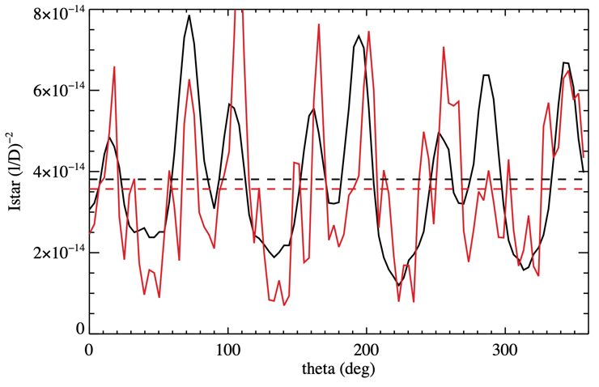
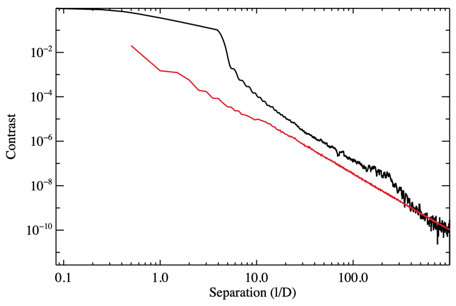

# ESYWG Meeting - Exposure Time Calibration Effort
Date: 15 Apr 2024

**Context:** This is our sixth meeting. Our astrophysical fluxes at the telescope agree (except for a 9% difference in stellar flux which is still being investigated). Most intermediate parameters agree and count rates are close, but we still have disagreement in T_core, I_star, CR_bs, and CR_bstray.

**Progress since last meeting:**

Chris, Sarah, & Armen: have been looking into issues regarding T_core, I_star, and CR_bstray.

## Reviewing the numbers…
Looking at HIP 32439…

### Intermediate parameter review
**T_core:** We now have agreement on T_core. We corrected an issue discovered during our last meeting that was leading to unintentional use of the wrong photometric aperture.

**I_star:** at the last meeting we did not agree on this but we are now in agreement. The issue was that EXOSIMS uses the azimuthally averaged coronagraph performance whereas AYO uses the 2D maps. The plot below shows the value of I_star as a function of azimuthal angle (x-axis) for two different methods of measurement (black and red lines). The horizontal lines show the azimuthal average. Because the performance of the coronagraph’s contrast can vary significantly as a function of azimuthal angle our values did not agree. Chris updated AYO to temporarily use the azimuthal average for this comparison and I_star now agrees between all 3 codes.

**All intermediate parameters now agree**

**All count rates now agree (to within differences that can be explained)**

**Exposure times:**

**t_science:** still does not agree between codes. Chris added a line called “Check on t_science (AYO equation)” that calculates the exposure time in the spreadsheet using the values reported earlier. Sarah and Armen added a similar line for EXOSIMS's equation. There are two differences in the exposure time equation adopted that explain all of the difference:
- AYO includes the planet’s count rates as a source of noise. EXOSIMS ignores this for detection observations in agreement with Bijan’s Roman CGI standards. As planet count rates are not expected to dominate for most targets, this difference in convention is not a concern.
- AYO multiplies all background count rates by a factor of 2 to account for ADI which is chosen as a conservative baseline. EXOSIMS does not include this by default (but can if desired). This is simply a difference in assumption about PSF subtraction and not something that needs to be fixed.

### Looking at HIP 77052…

**Count rate review:**

**CR_bstray:** AYO’s count rates are ~100x higher than EBS. EXOSIMS is many orders of magnitude higher.

At the last meeting Armen found he had different separation and dmag for the stellar companion. We reviewed the WDS data and determined those values appear to be erroneous and due to a mishandling of the WDS data. Armen will temporarily update those values while we trace the cause of this problem and see if it exists elsewhere.

Chris found that AYO and EXOSIMS were adopting different descriptions of the telescope PSF at large separations (see below). Both were provided by Dan Sirbu but were created under different assumptions at different dates. After discussing with Dan he suggested AYO adopt the same PSF description as EXOSIMS which was created more recently for HabEx. This model will likely need to be updated for HWO however.

After updating the PSF model AYO’s binary count rates were reduced by a factor of ~4. Still does not explain the remaining factor of ~20x.

Discussion of the formulas used to calculate stray light from binary companion. Formulas are fairly similar. One source of difference is that EXOSIMS applies the core throughput of the coronagraph whereas AYO applies “skytrans” assuming it’s a diffuse source. This could account for another factor of ~2 but does not explain everything.

Chris will add rows to the “intermediate parameters” section to report C_star and separation of binary in units of l/D. This will allow us to find the source of the difference.

**Action items:**

- Chris: add C_star and s_binary intermediate parameters to spreadsheet.
- Chris, Sarah, Armen: Update all #s in the spreadsheet
- Chris, Sarah, Armen: add values for C_star and s_binary and tag up by email to figure out the source of difference in stray light values
- Chris: create another spreadsheet for spectral characterization comparison
- Chris: continue to reach out to Eric Mamajek to make sure we understand the proper parsing of the WDS data prior to suggesting a change to the ExoCAT update file.

